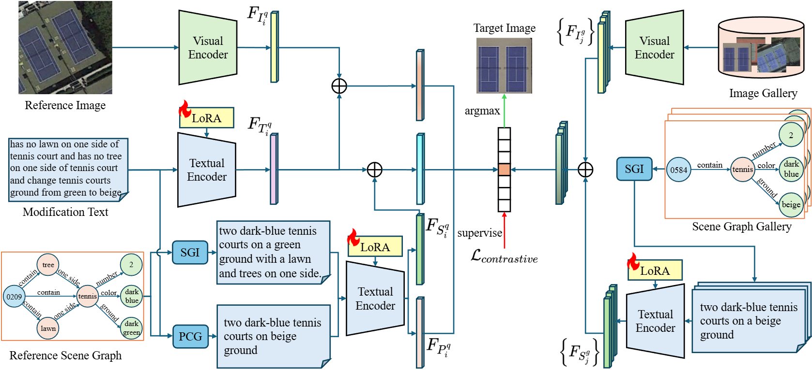

# LEmpo

## Overview


## Overall Performance
| Method  | Dataset   | R@1  | R@5  | R@10 | R@20 | mR   |
|--------|----------|------|------|------|------|------|
| SHF    | Airplane | 62.15 | 96.22  | 98.43  | 99.37  | 89.04  |
| LEmpo  | Airplane | 73.30 | 99.24  | 100.00  | 100.00 | 93.14   |
| SHF    | Tennis   | 43.23    | 84.93  | 93.89 |96.83  |  79.72  |
| LEmpo  | Tennis   | 68.34     | 97.82  | 99.56  | 100.00  | 91.43 |
| SHF    | WHIRT    | 5.08     | 21.60  | 36.33 | 54.12  |29.28 |
| LEmpo  | WHIRT    | 25.42    | 56.35  | 71.34  | 84.66 | 59.44 |


## Getting Started
## Environment
```python
python=3.9
pip install torch==2.2.0 torchvision==0.17.0 torchaudio==2.2.0 --index-url https://download.pytorch.org/whl/cu118
pip install transformers==4.51.3
pip install openai==1.76.0
pip install open_clip_torch==2.28.0
```

## Data Preparation
If you want to reproduce the project, please contact the authors of [SHF](https://ieeexplore.ieee.org/document/10537211). We are very grateful to the authors for sharing the dataset.

We provide the SGI and PCG results of the three datasets under the path ```precomputed/pseudo_caption```, where gallery in the file name represents SGI and query represents PCG.

## Weight Preparation
For the LLM and VLM, please download the model weight from [HuggingFace](https://huggingface.co) and save in the path ```ckpts```. For example, please download the weights of Qwen2.5-7B from [here](https://huggingface.co/Qwen/Qwen2.5-7B-Instruct) and GeoRSCLIP-ViT-L/14 from [here](https://huggingface.co/Zilun/GeoRSCLIP/tree/main/ckpt).
## SGI & PCG
```python
python captioner.py \
--dataset {dataset name} \
--split {train or val} \
--mode {gallery or query} \ # gallery for SGI, query for PCG
--dataset_path {dataset path}  \
--save_path {save path} \
--batch_size 128 \
--llm {LLM name}\
```

## Train
```python
python train.py \
--model_name {model name}\
--backbone {backbone version} \
--dataset {dataset name}\
--dataset_path {dataset path} \
--pseudo_caption_path {path of pseudo caption files} \
--epoch 30 \
--lr 2e-4 \
--batch_size 16 \
--position all \
--encoder text \
--params q v \
--r 8 \
--alpha 16 \
--dropout 0.2 \
--ckpt_path {output path of LoRA weight} \
--task_name {specific task name} \
--margain 0.2 \
--query triplet_lang_pse \
--gallery im_sg \
--llm {LLM name} \
```

## Test
```python
python test.py \
--model_name {model name}\
--backbone {backbone version} \
--dataset {dataset name}\
--dataset_path {dataset path} \
--pseudo_caption_path {path of pseudo caption files} \
--position all \
--encoder text \
--params q v \
--r 8 \
--alpha 16 \
--dropout 0.2 \
--ckpt_path {output path of LoRA weight} \
--task_name {specific task name} \
--query triplet_lang_pse \
--gallery im_sg \
--llm {LLM name} \
```

## Acknowledgement
Our work is built on the following open-source projects. We really appreciate their excellent open-source works!
- [SHF](https://ieeexplore.ieee.org/document/10537211)
- [transformers](https://github.com/huggingface/transformers)
- [CLIP-LoRA](https://github.com/MaxZanella/CLIP-LoRA)
- [CLIP](https://github.com/openai/CLIP)
- [OpenCLIP](https://github.com/mlfoundations/open_clip)
- [Tip-Adapter](https://github.com/gaopengcuhk/Tip-Adapter)